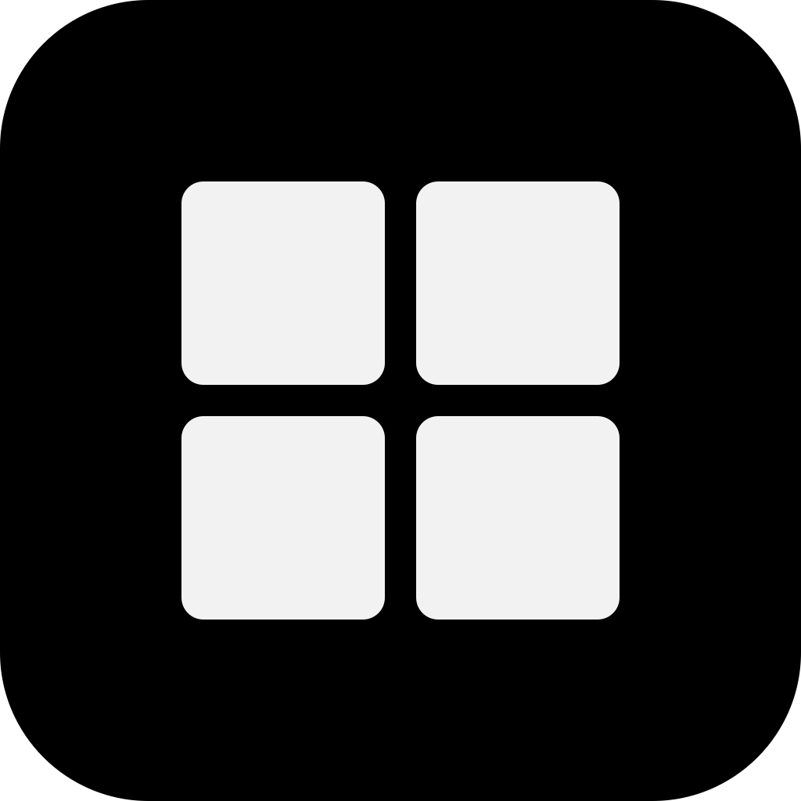
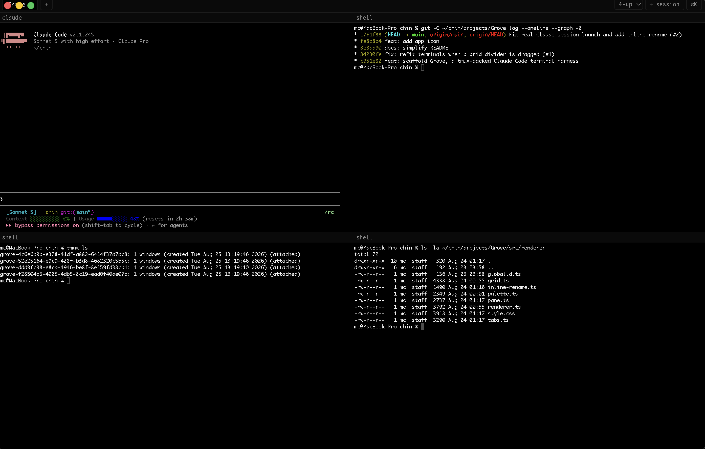
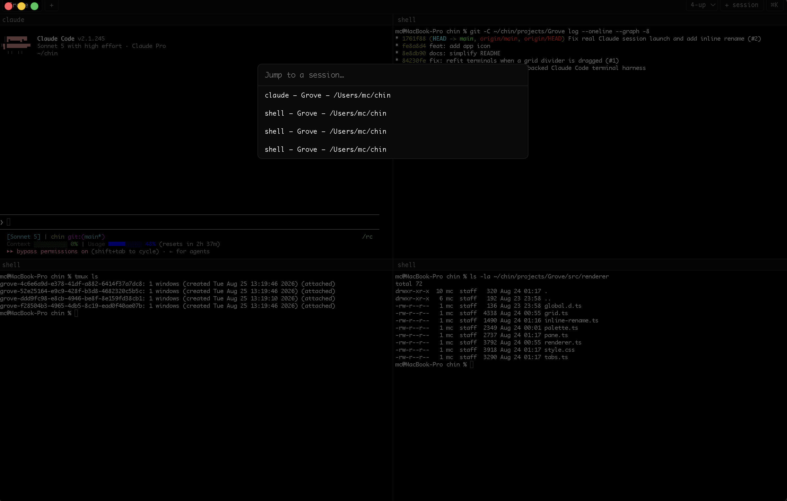

<p align="center">
  
</p>

<h1 align="center">Grove</h1>

<p align="center">A desktop app for running several Claude Code sessions side by side, in one window.</p>

<p align="center">
  
</p>

Each tab holds a grid of panes — 1, 2, 4, 6, or 8 at a time. Drag the dividers to resize. Double-click a tab or a pane to rename it. Press `⌘K` to search and jump to any session.

Grove runs each session in `tmux`, so closing the app (or a crash) doesn't kill your work — reopen Grove and everything is still there.

<table>
<tr>
<td width="50%">

**Multi-pane grid**
Split a tab into up to 8 live panes, each its own `tmux`-backed session — Claude Code or a plain shell.

</td>
<td width="50%">

**⌘K session search**
Jump straight to any session across every tab without touching the mouse.



</td>
</tr>
</table>

## Requirements

- macOS
- [tmux](https://github.com/tmux/tmux) — `brew install tmux`
- The Claude Code CLI (`claude`) on your `$PATH`

## Running it

```sh
npm install
npm start
```

## Development

```sh
npm test         # run tests
npm run typecheck
npm run lint
```

## More

- [License](LICENSE) — MIT
